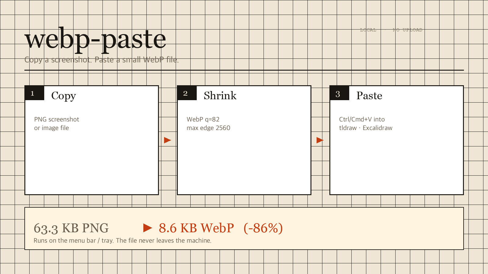

<h1 align="center">
   webp-paste
</h1>

<p align="center">
  <a href="https://github.com/Chokoty/webp-paste"></a>
  
  
  
</p>

<p align="center">
  <sub><a href="docs/readme/README.ko.md">한국어</a></sub>
</p>

<p align="center">
  <strong>Copy a screenshot. Paste a small WebP file.</strong><br/>
  Menu bar on Mac, tray on Windows. The image never leaves the machine.
</p>

<p align="center">
  
</p>

tldraw and Obsidian Excalidraw take whatever is on the clipboard. A PNG screenshot is large. Chrome will not put WebP on the clipboard (`NotAllowedError`), so this app writes a **file** instead. `⌘V` / `Ctrl+V` pastes that file.

On the fixture PNG (1600×900, 63.3 KB) the Mac encoder produces **8.6 KB WebP (−86%)**.

## Features

<table>
<tr>
<td width="50%" valign="top">

### Menu bar / tray

Always on. Copy an image; the clipboard becomes a `.webp` file. Turn **변환** off when you need the original PNG.

</td>
<td width="50%" valign="top">

### Local only

No account, no server, no folder watcher. Encode runs in-process. Temp files stay in the OS cache directory (last 12 kept).

</td>
</tr>
<tr>
<td width="50%" valign="top">

### Mac: WebP or AVIF

WebP via statically linked libwebp (Homebrew is build-time only). AVIF via ImageIO. Quality 82, long edge 2560.

</td>
<td width="50%" valign="top">

### Windows: WebP

Same quality and max edge. Clipboard write is a file drop list, not a DIB, so canvases take the file.

</td>
</tr>
</table>

**Also:** last conversion size in the menu, **저장…** to keep a copy, GIF/PDF/multi-file skipped, already-WebP skipped.

## Install

### macOS

```bash
brew install webp          # build only; the app links libwebp.a
./mac/build.sh
open mac/dist/webp-paste.app
```

Menu bar icon on → copy a screenshot → paste into the canvas. Original PNG: uncheck **변환**. Format: **포맷 → WebP / AVIF**.

Temps: `~/Library/Caches/webp-paste/`.

### Windows

Needs [.NET 8 SDK](https://dot.net) to build:

```powershell
./win/build.ps1
./win/dist/webp-paste.exe
```

CI also publishes `webp-paste.exe` as a workflow artifact on each push to `main`. Tray icon → copy → `Ctrl+V`. WebP only (no AVIF). Temps: `%LOCALAPPDATA%\webp-paste\`.

## Web fallback

Chrome still cannot write `image/webp` to the clipboard. Use the page to **download or drag** a file.

```bash
python3 -m http.server 8765
```

Open [http://127.0.0.1:8765](http://127.0.0.1:8765). `⌘V` converts; drag the preview or use **WebP 저장**. Right-click “copy image” in Chrome is PNG, so the page replaces that menu with save.

## How it works

```
clipboard image  →  resize (max 2560)  →  WebP q=82  →  file on clipboard
```

Mac polls `NSPasteboard.changeCount` every 0.4s. Windows listens for `WM_CLIPBOARDUPDATE`. Pasteboard payload is a file URL / `CF_HDROP` only, so the canvas does not fall back to a PNG bitmap.

ImageIO cannot write WebP. Details: [`docs/decisions/001-encode-backends.md`](docs/decisions/001-encode-backends.md), [`FINDINGS.md`](FINDINGS.md).

## Develop

```bash
./scripts/check.sh     # macOS: rebuild + encode fixtures/screenshot.png
```

`scripts/check.sh` must keep producing a RIFF/WEBP smaller than the fixture. Agent rules: [`AGENTS.md`](AGENTS.md). Specs: [`docs/superpowers/specs/`](docs/superpowers/specs/).

## License

MIT. See [LICENSE](LICENSE).
